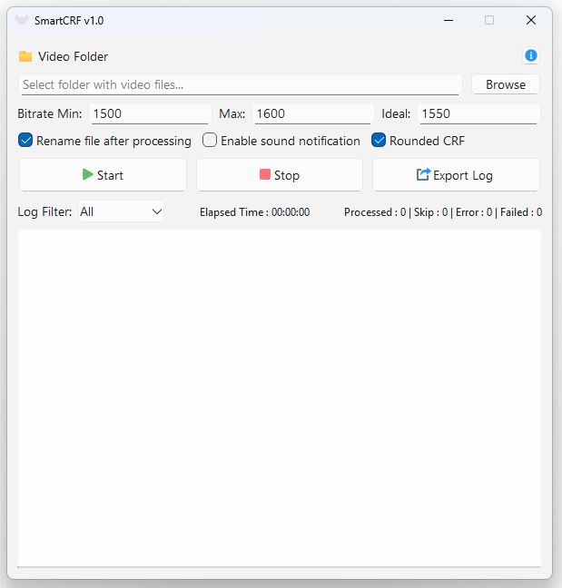
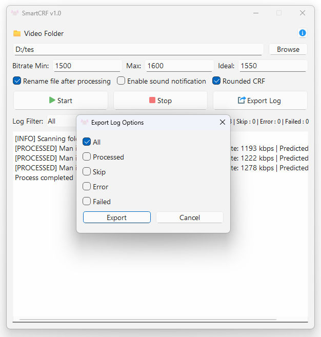
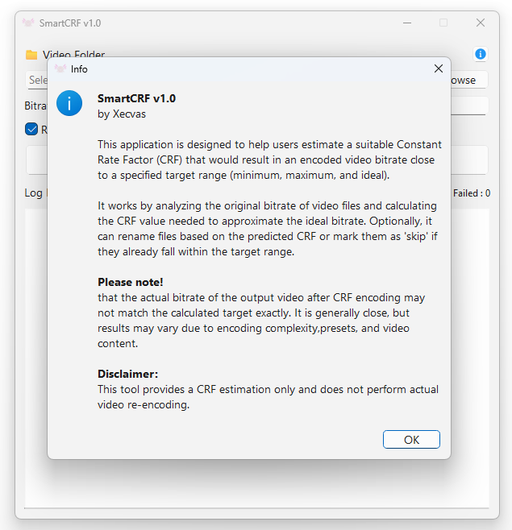

# 🎬 SmartCRF v1.0

<p align="center">
  
</p>

SmartCRF is a Python + PyQt6 desktop application designed to **automatically estimate optimal CRF (Constant Rate Factor)** values for video encoding. It analyzes video bitrate and provides fast, reliable results in a user-friendly interface.

<b>Please note!</b><br>
that the actual bitrate of the output video after CRF encoding may not match the calculated target exactly. It is generally close, but results may vary due to encoding complexity,presets, and video content.<br><br>

 <b>Disclaimer:</b><br>
 This tool provides a CRF estimation only and does not perform actual video re-encoding.

> ✅ This is the **final release** of SmartCRF. No further updates are planned unless critical bugs or new idea are discovered.

---

## 📦 Features

### 🎯 CRF Estimation Engine
- Auto-analyzes video bitrate using **MediaInfo CLI**
- Estimates optimal CRF values for re-encoding
- **Optional CRF Rounding** via checkbox (for clean output values)

### 🗂️ Batch File Support
- Processes only valid video formats:
- `.mp4`, `.mkv`, `.avi`, `.mov`, `.flv`, `.wmv`, `.webm`, `.ts`, `.m4v`, `.3gp`, `.mpeg`, `.mpg`
- Auto-renaming with overwrite protection

### 🔔 Notifications
- Optional sound alerts for key processing events

### 🧾 Real-Time Log & Stats
- Live-updating log viewer (scrollable, non-wrapping)
- Status counters with categories: `[PROCESSED]`, `[SKIP]`, `[ERROR]`, `[FAILED]`
- Filterable logs
- Export log by category

### 🖼️ UI/UX
- Responsive layout with consistent button sizing
- Font size optimized for readability (14px)
- Scrollbars for large logs

### 🧩 Technical & Code Features
- use **MediaInfo CLI** for faster processing
- Modular, readable, and refactored codebase
- Signal-slot architecture with PyQt6
- Foundation for future expansion: presets, manual CRF, etc.

---

## 💻 Screenshots

<p align="center">
  
</p>

<p align="center">
  
</p>

<p align="center">
  
</p>
---

## 🚀 Quick Download (For Non-Technical Users)

If you're not familiar with Python or don't want to set up anything manually, simply:

👉 [**Download the Windows `.exe` version here**](https://github.com/xecvas/smart-crf/releases)  
> No Python installation needed. Just download and run.

---

## 🛠️ Installation (For Developers)

### 1. Clone the Repository
```bash
git clone https://github.com/xecvas/smartcrf.git
cd smartcrf
```

### 2. Set Up Environment
Install required dependencies (preferably in a virtual environment):

```bash
pip install -r requirements.txt
```

Make sure `mediainfo.exe` is available in the `bin/` directory.

### 3. Run the App
```bash
python main.py
```

---

## 📦 Build to EXE (Optional)

To build your own `.exe`:

```bash
pyinstaller --onefile --noconsole --icon=assets/icon.ico ^
--add-data "assets;assets" --add-data "bin/Mediainfo.exe;bin" main.py
```

Add `--upx-dir` if you use UPX compression.

---

## 📄 License

SmartCRF is released under the MIT License.  
See [LICENSE](LICENSE) for details.

---

## 🤝 Credits

- **UI Framework**: [PyQt6](https://pypi.org/project/PyQt6/)
- **Media Analysis**: [MediaInfo CLI](https://mediaarea.net/en/MediaInfo)
- **Built with** ❤️ to simplify video encoding workflows

Feedback or forks welcome — but this is the final official build.
